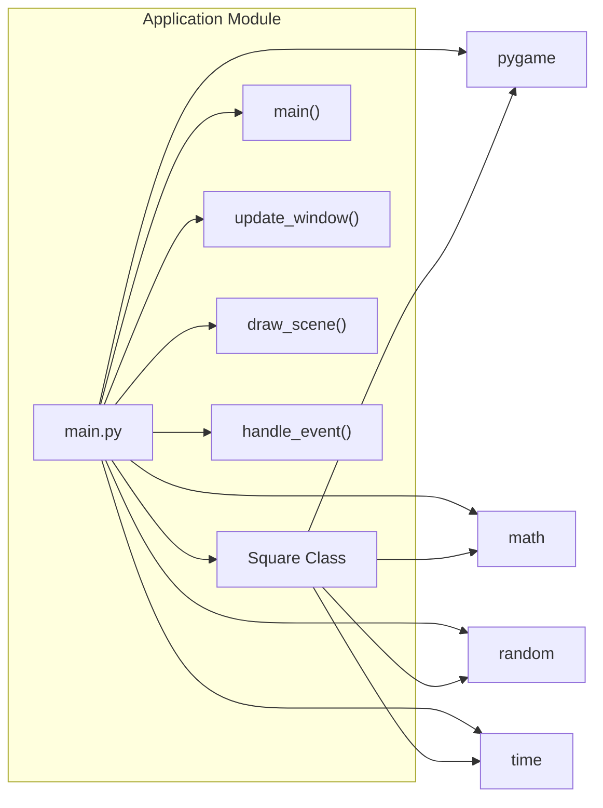
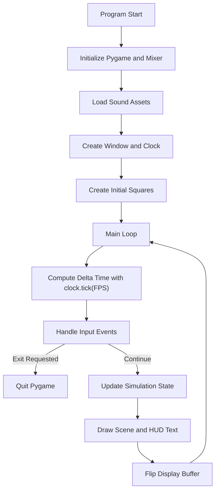
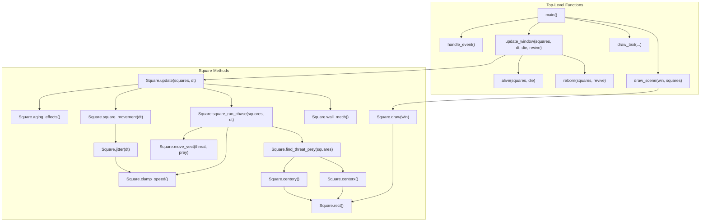
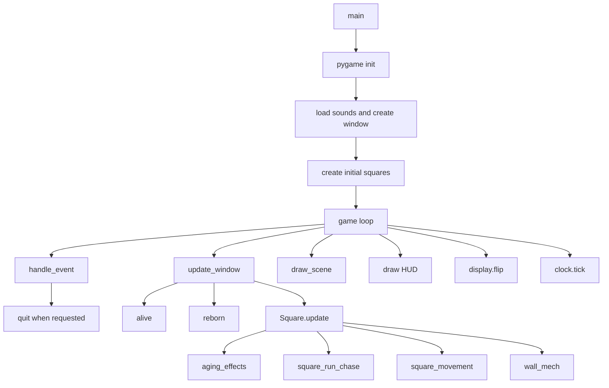

# Architecture Documentation

## Scope
This document describes the current architecture implemented in `main.py`.
The project is a single-file Pygame simulation with one domain class (`Square`) and top-level orchestration functions.

## 1) Module Dependency Graph



## 2) High-Level Runtime/System Flow



## 3) Function-Level Call Graph



## 4) Primary Execution Path (Sequence Diagram)

```mermaid
sequenceDiagram
    participant BOOT as "Program Bootstrap"
    participant LOOP as "Main Loop"
    participant INPUT as "Input Handler"
    participant WORLD as "World Updater"
    participant LIFE as "Lifecycle Manager"
    participant ENTITY as "Square Entity"
    participant RENDER as "Renderer"
    participant DISPLAY as "Display System"

    BOOT->>BOOT: "pygame.init() and pygame.mixer.init()"
    BOOT->>BOOT: "Load revive.mp3 and death.mp3"
    BOOT->>DISPLAY: "Create window and set caption"
    BOOT->>LOOP: "Initialize clock, font, and square list"

    loop "Each Frame While run is True"
        LOOP->>LOOP: "dt = clock.tick(FPS) / 1000"
        LOOP->>INPUT: "handle_event()"

        alt "Quit Event or Q Key"
            INPUT-->>LOOP: "False"
            LOOP->>DISPLAY: "pygame.quit()"
        else "Continue Simulation"
            INPUT-->>LOOP: "True"
            LOOP->>WORLD: "update_window(squares, dt, die, revive)"
            WORLD->>LIFE: "alive(squares, die)"
            LIFE-->>WORLD: "filtered survivors"
            WORLD->>LIFE: "reborn(squares, revive)"
            LIFE-->>WORLD: "replenished list"

            loop "For Each Square"
                WORLD->>ENTITY: "square.update(squares, dt)"
                ENTITY->>ENTITY: "aging_effects()"
                ENTITY->>ENTITY: "square_run_chase()"
                ENTITY->>ENTITY: "square_movement()"
                ENTITY->>ENTITY: "wall_mech()"
            end

            LOOP->>RENDER: "draw_scene(win, squares)"
            RENDER->>ENTITY: "square.draw(win) for each square"
            LOOP->>RENDER: "draw_text() for FPS, controls, count"
            LOOP->>DISPLAY: "pygame.display.flip()"
        end
    end
```

## Notes
- The simulation state is fully in memory.
- There is no networking, persistence, or multi-threading in the current source.
- `find_threat_prey()` scans all squares for each square, which gives pairwise interaction cost as population grows.
# Architecture Documentation

## Overview

This project is a compact Pygame simulation that animates a population of moving squares.
The application is centered on a single runtime loop in `main.py`, with a small set of helper
functions and one main domain class, `Square`.

Key characteristics:

- Single-process, real-time graphical application
- In-memory simulation state only
- Frame-based update/render loop driven by `pygame.time.Clock`
- Entity behavior combines random jitter, wall handling, lifetime aging, and size-based chase/escape logic

## Main Components

### `main()`

The entry point initializes Pygame, loads sounds, creates the window, and runs the main loop.
It is responsible for:

- setting up the display
- loading audio assets
- creating the initial square population
- ticking the clock each frame
- calling update and draw functions
- closing Pygame cleanly on exit

### `Square`

`Square` is the core simulation object. Each instance stores:

- position via `vector`
- velocity via `movement_vect`
- size and speed limits
- lifespan and birth time
- current color based on age

It also contains the logic for movement, steering, edge bouncing, and visual aging.

### Top-Level Helpers

- `handle_event()` reads quit events and exits when the window closes or `Q` is pressed.
- `alive()` removes expired squares and triggers the death sound.
- `reborn()` creates new squares until the population reaches `SQUARE_COUNT`.
- `update_window()` applies lifecycle updates and per-square simulation updates.
- `draw_scene()` clears the screen and draws every square.
- `draw_text()` renders the HUD overlay.

## Runtime Flow



## Sequence of a Frame

```mermaid
sequenceDiagram
    participant Loop as Main Loop
    participant Input as handle_event
    participant World as update_window
    participant Square as Square
    participant Render as draw_scene

    Loop->>Input: poll events
    Input-->>Loop: continue or exit
    Loop->>World: update_window(squares, dt, die, revive)
    World->>World: alive()
    World->>World: reborn()
    World->>Square: update(squares, dt)
    Square->>Square: aging_effects()
    Square->>Square: square_run_chase()
    Square->>Square: square_movement(dt)
    Square->>Square: wall_mech()
    Loop->>Render: draw_scene(win, squares)
    Loop->>Loop: draw_text() and flip display
```

## Square Behavior Details

### Aging

`aging_effects()` computes an age ratio from `birth_time` and `life_span`, then blends the
base square color toward a red tone.

### Steering

`find_threat_prey()` scans the full square list and picks:

- the closest larger square as a threat
- the closest smaller square as prey

`move_vect()` converts those relationships into a movement vector by combining:

- escape force from threats
- chase force toward prey
- wall push force near the edges

### Movement

`jitter(dt)` adds small random perturbations to the velocity.
`square_movement(dt)` applies the velocity to position using delta time.
`wall_mech()` clamps the square back inside the screen and flips direction when needed.

## Data Flow

1. `pygame.event.get()` determines whether the app keeps running.
2. `clock.tick(FPS)` produces frame time `dt`.
3. `update_window()` mutates the square list and each square's state.
4. `draw_scene()` renders the updated state.
5. `pygame.display.flip()` presents the frame.

This is a stateful loop with no persistence layer, no networking, and no background workers.

## Architectural Notes

- The code is intentionally simple and beginner-friendly.
- Most simulation behavior is inside `Square`, while application orchestration stays at module level.
- The design is easy to follow, but `find_threat_prey()` is O(n^2) across all squares per frame.
- The current file is a good candidate for splitting into rendering, simulation, and app bootstrap modules later.

## Suggested Next Steps

- Move `Square` into its own module if the simulation grows.
- Introduce a spatial grid to reduce neighbor scanning cost.
- Add a deterministic random seed option for testing.
- Extract sound and window setup into a small initialization function.
